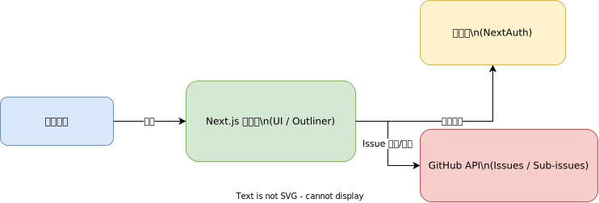

# GitHub Issue Outliner

GitHub の Issue を、親子関係つきで見やすく整理するためのアプリです。

このツールを使うと、以下のことができます。

- Issue を一覧で読みやすく表示する
- 親 Issue と子 Issue のつながりを階層で管理する
- 並び替えや編集を通して、作業計画を組み立てる

開発者向けの細かい設定を意識しなくても、Issue の全体像を把握しやすくすることを目的にしています。

## 全体イメージ

## 主なページ

- リポジトリ選択画面
- Issue アウトライナー画面
- ログイン画面

## プロジェクトの現在地

- 現在できること、実装済みの範囲、次のタスクは [現状と次アクション](./Status-and-Roadmap) を参照してください。

## 補足

仕様の詳細は [Specification](./Specification) を参照してください。
